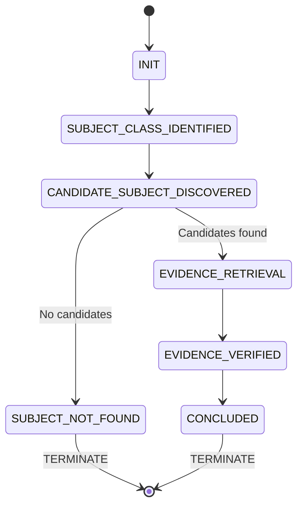

## Skill Responsibility

This skill is responsible for:

* Retrieving relevant information from a specified knowledge base
* Transforming raw text into verifiable evidence units
* Detecting conflicting claims related to the same factual question
* Evaluating answer sufficiency and confidence
* Explicitly surfacing uncertainty and risk signals, along with suggested follow-up actions

This skill is **not responsible for**:

* Arbitrating between conflicting claims
* Making investment, legal, or business decisions
* Controlling workflow execution (e.g., retries, looping, escalation)

---

## Design Invariants

The following invariants must hold in any execution environment:

1. **Evidence-bound**

   * All key conclusions must be supported by evidence from the knowledge base
   * No external knowledge or common-sense assumptions may be introduced

2. **Traceability**

   * Every material claim must be traceable to a specific location in the original source
     (document name, page, section, paragraph, line, or clause)

3. **Non-assumptive**

   * Insufficient or conflicting evidence must be explicitly marked as uncertain
   * No gap-filling based on plausibility, convention, or experience

4. **Conflict-aware**

   * Multiple conflicting claims about the same fact must be surfaced with their citations
   * Conflicts are treated as risk signals, not automatically resolved

5. **Agentic-compatible**

   * Outputs must expose structured signals usable by downstream agents or humans:
     `confidence`, `sufficient`, `conflicts`, `suggested_next_actions`

6. **Subject Existence** (Hard Gate)

   * A conclusion MUST NOT be produced unless at least one candidate subject that explicitly matches the query subject class is identified in the knowledge base
   * If no such subject is found, the system MUST return `sufficient = false` and MUST NOT substitute semantically similar subjects
   * "I don't know" is a valid capability in agent systems; "hard answering" under subject absence is a defect
   * This invariant prevents semantic fallback under subject absence
   * Applies universally to all subject types: entities, individuals, products, locations, time periods, jurisdictions, etc.

7. **Entity Binding**

   * A candidate subject MUST have an explicit and verifiable binding to the parent entity specified in the query subject class
   * Role or title similarity alone is insufficient
   * Valid binding mechanisms: ownership, registration, contractual role, or explicit statement in source text
   * If the parent entity relationship cannot be explicitly established from the knowledge base, the subject MUST NOT be considered a valid candidate
   * This invariant prevents accepting subjects that "look like" matches but lack the required entity relationship

8. **Subject-Evidence Integrity**

   * Any evidence used to support a conclusion MUST explicitly confirm that the subject of the evidence matches the subject of the query
   * If subject identity or scope cannot be unambiguously established, the evidence MUST NOT be used to support the conclusion
   * Subject drift is a critical error that invalidates the entire conclusion
   * This invariant applies universally: companies, individuals, products, locations, time periods, jurisdictions, legal entities, or any other subject type

---

## When to Use

Use this skill when the task requires:

* **Knowledge base Q&A** - Answering questions based on specific documents or knowledge bases with source attribution
* **Evidence verification** - Retrieving and verifying factual claims from documents
* **Due diligence queries** - Investigating facts from multiple sources with conflict detection
* **Multi-source analysis** - Synthesizing information from multiple documents with explicit citations
* **Fact-checking** - Verifying claims against source documents

Typical use cases include:

* Knowledge base queries requiring evidence traceability
* Document analysis with source attribution
* Compliance or legal document review
* Research analysis and fact verification

Not suitable for:

* Casual or conversational generation tasks
* Queries that do not require source attribution or traceability
* Creative writing or brainstorming tasks

---

## Inputs & Outputs

This skill does **not** impose a fixed schema on inputs or outputs.

* Inputs are organized by the calling Agent or runtime (e.g., question, knowledge base scope, constraints).
* Outputs aim to be **structured and machine-consumable**, but concrete field shapes are determined by the integration context.

Core invariants enforced by the skill:

* All conclusions must be evidence-backed
* Conflicts, uncertainty, and risk signals must be explicitly surfaced

---

## Execution State Machine

This skill implements a **strict, irreversible state machine** to eliminate non-deterministic execution paths.

### States

**State Definitions:**

| State | Description | Terminal |
|-------|-------------|----------|
| `INIT` | Initial state, query received | No |
| `SUBJECT_CLASS_IDENTIFIED` | Query subject class extracted and validated | No |
| `CANDIDATE_SUBJECT_DISCOVERED` | Candidate subjects searched in KB | No |
| `SUBJECT_NOT_FOUND` | No matching candidates exist | **Yes** |
| `EVIDENCE_RETRIEVAL` | Knowledge retrieval executed | No |
| `EVIDENCE_VERIFIED` | Subject-evidence integrity verified | No |
| `CONCLUDED` | Final conclusion generated | **Yes** |

### State Transition Rules (MANDATORY)

1. **Linearity**: State transitions MUST follow the defined order. No state may be skipped.

2. **Irreversibility**: Once a state is entered, the system MUST NOT transition back to a previous state.

3. **Hard Gate Enforcement**:
   - `CANDIDATE_SUBJECT_DISCOVERED` is a HARD GATE
   - If `candidate_subjects == []`, MUST transition to `SUBJECT_NOT_FOUND`
   - `SUBJECT_NOT_FOUND` is a TERMINAL state - no further execution allowed

4. **Forbidden Transitions**:
   - `SUBJECT_NOT_FOUND` → any state other than termination
   - Any state → `SUBJECT_CLASS_IDENTIFIED` (re-planning forbidden)
   - `EVIDENCE_RETRIEVAL` → `SUBJECT_CLASS_IDENTIFIED` (query re-interpretation forbidden)

5. **Forbidden Behaviors**:
   - Skipping `CANDIDATE_SUBJECT_DISCOVERED` to proceed directly to retrieval
   - Relaxing subject constraints after `SUBJECT_NOT_FOUND`
   - Substituting semantically similar subjects when candidates are empty
   - Re-interpreting the query to improve answer completeness

### Execution Contract

**Determinism Guarantee:**
The same input MUST always produce the same execution path through the state machine.

**Termination Guarantee:**
Execution MUST terminate in one of two terminal states:
- `SUBJECT_NOT_FOUND` (when no candidate subjects exist)
- `CONCLUDED` (when evidence-based conclusion is generated)

**No-Replay Guarantee:**
If execution terminates in `SUBJECT_NOT_FOUND`, the system MUST NOT:
- Retry with alternative search strategies
- Reformulate the query
- Relax subject constraints
- Attempt additional retrievals

---

## Execution Semantics

### State 0: INIT

Receive and validate the query.

### State 1: Identify Query Subject Class

**Entry Condition:** State = `INIT`

**Action:**
* Analyze the query to identify the subject class and its defining characteristics
* Extract subject attributes: type, scope, constraints, relationships
* Example: "Entity A contractual obligations" → subject_class = {type: legal_entity, name: Entity A, document_type: contract}

**Exit Condition:** Subject class successfully extracted

**Next State:** `SUBJECT_CLASS_IDENTIFIED` → `CANDIDATE_SUBJECT_DISCOVERED`

---

### State 2: Candidate Subject Discovery (HARD GATE)

**Entry Condition:** State = `SUBJECT_CLASS_IDENTIFIED`

**Action:**
* Search the knowledge base for subjects that match the query subject class
* Apply **Candidate Subject Validity Rule** (MANDATORY):

  A subject S is a valid candidate **IFF** all conditions are satisfied:
  1. S matches the **subject type** (e.g., individual, entity, product)
  2. S matches the **subject role** (e.g., founder, shareholder, contractor)
  3. S has an **explicit parent_entity binding** that matches the query
     - Via ownership (e.g., "founder of Entity A")
     - Via registration (e.g., "registered agent for Entity A")
     - Via contractual role (e.g., "party to Master Services Agreement with Entity A")
     - Via explicit statement in source text (e.g., "Entity A's founder is...")

  **If condition (3) is NOT satisfied, S MUST be rejected.**

* **INVALID Examples** (role similarity without entity binding):
  - Query: "Entity A's founder" → KB has "Company founder" but no binding to Entity A → **REJECT**
  - Query: "Entity A's contractual obligations" → KB has "MSA obligations" but Entity A is not a party → **REJECT**
  - Query: "Supplier X's subsidiaries" → KB has "subsidiaries" but not under Supplier X → **REJECT**

* Output format: `candidate_subjects: [{subject_id, name, class_attributes, parent_entity_binding, source_location}]`

**Decision Point:**

**IF `candidate_subjects == []`:**
* Set `sufficient = false`
* Set `confidence = low`
* Set `risk_signal = subject_not_found`
* Provide `suggested_next_actions` for sourcing missing subject information
* **Next State:** `SUBJECT_NOT_FOUND` → `TERMINATE`
* **FORBIDDEN:** Any further retrieval, query reformulation, or alternative interpretation

**IF `candidate_subjects != []`:**
* Proceed to evidence retrieval
* **Next State:** `EVIDENCE_RETRIEVAL`

---

### State 3: Evidence Retrieval

**Entry Condition:** State = `CANDIDATE_SUBJECT_DISCOVERED` AND `candidate_subjects != []`

**Action:**
* Retrieve candidate document fragments from the specified knowledge base
* **CONSTRAINT:** All retrieval queries MUST include identifiers from `candidate_subjects`
* Filter retrieval to ONLY include documents that reference the identified candidate subjects
* Prefer multiple independent sources to enable cross-verification

**Exit Condition:** Retrieval completed

**Next State:** `EVIDENCE_VERIFIED`

---

### State 4: Evidence Extraction

**Entry Condition:** State = `EVIDENCE_RETRIEVAL`

Transform retrieved text into **locatable evidence units**, ensuring each key claim can be traced back to its original source.

---

### State 5: Subject-Evidence Integrity Verification

**Entry Condition:** State = `EVIDENCE_EXTRACTION`

**Action:**
* For each evidence unit, verify that the subject of the evidence matches the subject of the query
* Extract and compare subject identifiers: entity names, dates, locations, jurisdictions, roles, scopes
* Reject evidence where subject identity or scope cannot be unambiguously confirmed as matching

**Next State:** `CONCLUDED`

---

### State 6: Concluded

**Entry Condition:** State = `EVIDENCE_VERIFIED`

**Action:**
* Assess `confidence` based on evidence coverage, independence, and presence of conflicts
* Determine `sufficient` with respect to the applicable confidence threshold
* When `sufficient = false`, provide actionable `suggested_next_actions`
* Generate final conclusion with evidence citations

**Next State:** `TERMINATE`

---

## Failure & Uncertainty Handling

### State-Level Failure Handling

**SUBJECT_NOT_FOUND State (Terminal):**

* **Trigger:** `candidate_subjects == []` at State 2
* **Mandatory Actions:**
  - Set `sufficient = false`
  - Set `confidence = low`
  - Set `risk_signal = subject_not_found`
  - Provide `suggested_next_actions` for sourcing missing subject information
* **FORBIDDEN Actions:**
  - DO NOT proceed to evidence extraction
  - DO NOT proceed to conclusion generation
  - DO NOT retry with alternative search strategies
  - DO NOT reformulate the query
  - DO NOT relax subject constraints
* **Execution:** MUST terminate immediately

### State Machine Invariants

1. **No Recovery from SUBJECT_NOT_FOUND:** Once in this terminal state, execution MUST NOT continue

2. **No Query Reinterpretation:** After State 1, the query MUST NOT be reinterpreted

3. **No Constraint Relaxation:** Subject constraints identified in State 1 MUST NOT be relaxed in subsequent states

4. **No Semantic Substitution:** Empty `candidate_subjects` MUST NOT trigger fallback to semantically similar subjects

---

## Other Failure Modes

* **Subject not found** (Candidate Subject Gate failure):
  - Set `sufficient = false`
  - Set `confidence = low`
  - Set `risk_signal = subject_not_found`
  - Provide `suggested_next_actions` for sourcing missing subject information
  - DO NOT proceed to evidence extraction or conclusion generation

* **Missing critical evidence**: mark `sufficient = false` and specify missing information

* **Conflicting evidence**: surface conflicts without arbitration

* **Inconclusive results**: explicitly state uncertainty and propose verification steps

---

## Integration Notes

* Downstream Agents or workflows may consume the structured signals to decide:

  * Whether to escalate to human review
  * Whether to request additional materials
  * Whether to trigger further verification or retrieval steps

> Note: Workflow control strategies are defined by the calling system. This skill provides only auditable evidence and risk signals.

---

## Example

> The following example illustrates the *behavioral characteristics* of the skill
> (evidence grounding, conflict exposure, uncertainty signaling), not a required format.

**Example question:**
Is there a clearly defined constraint or entitlement associated with this matter?

**Example output (expressive illustration):**

* Conclusion: It cannot be confidently determined whether a clearly applicable entitlement exists.
* Evidence:

  * *Policy_Document_v1*, Section 3: Mentions a constraint related to the matter, but does not specify scope or activation conditions.
* Conflicts:

  * No direct clause conflicts identified, but descriptions of applicability differ across documents.
* Confidence: Low to medium.
* Risk note: Without clear scope and activation conditions, this conclusion should not be treated as definitive.
* Suggested next actions:

  * Clarify the applicable subjects of the clause
  * Verify whether supplementary or final versions of the document exist

---

**Example 2: Candidate Subject Gate (Subject Not Found)**

**Example question:**
What are the contractual obligations of Entity A under the Master Services Agreement?

**Example execution with Subject Existence Invariant:**

* Step 1 - Identify Query Subject Class:
  * subject_type: legal entity
  * document_type: Master Services Agreement
  * relationship: contractual obligations

* Step 2 - Candidate Subject Discovery:
  * Search knowledge base for: "Entity A" + "Master Services Agreement"
  * Result: `candidate_subjects: []`
  * HARD GATE TRIGGERED

* Step 3 - Short-circuit (DO NOT proceed to evidence retrieval):
  * sufficient: false
  * confidence: low
  * risk_signal: subject_not_found
  * Conclusion: The knowledge base does not contain a Master Services Agreement for Entity A.

* Suggested next actions:
  * Request Master Services Agreement for Entity A
  * Verify if Entity A is a party to any similar agreements in the knowledge base
  * Clarify whether Entity A operates under a different legal name

**What MUST NOT happen:**
* DO NOT retrieve contractual obligations for Entity B as a substitute
* DO NOT assume Entity A's obligations match those of other entities
* DO NOT proceed with evidence extraction when no candidate subjects exist

---

**Example 3: Entity Binding Invariant (Invalid Candidates Rejected)**

**Example question:**
What is the educational background of Entity A's founder?

**Example execution WITHOUT Entity Binding Invariant (WRONG):**

* Step 1 - Identify Query Subject Class:
  * subject_type: individual
  * role: founder
  * parent_entity: Entity A

* Step 2 - Candidate Subject Discovery (WITHOUT binding validation):
  * Search knowledge base for: "founder" + "education"
  * Found: "John Doe, Founder of [Company], MBA from Harvard"
  * Result: `candidate_subjects: ["John Doe"]` (WRONG - no Entity A binding)
  * Proceeds to evidence retrieval → **INCORRECT CONCLUSION**

**Example execution WITH Entity Binding Invariant (CORRECT):**

* Step 1 - Identify Query Subject Class:
  * subject_type: individual
  * role: founder
  * parent_entity: Entity A

* Step 2 - Candidate Subject Discovery (WITH binding validation):
  * Search knowledge base for: "founder of Entity A"
  * Potential matches found:
    * "John Doe, Founder" → **REJECTED** (no parent_entity binding to Entity A)
    * "Jane Smith, CEO of Entity A" → **REJECTED** (wrong role: CEO, not founder)
  * Apply Entity Binding Validity Rule:
    * Condition 1 (type): ✅ John Doe is an individual
    * Condition 2 (role): ✅ John Doe is a founder
    * Condition 3 (parent_entity binding): ❌ No explicit binding to Entity A found
  * Result: `candidate_subjects: []` (all candidates rejected)
  * HARD GATE TRIGGERED

* Step 3 - Short-circuit:
  * sufficient: false
  * confidence: low
  * risk_signal: subject_not_found
  * Conclusion: The knowledge base does not contain information about Entity A's founder.

**Key Difference:**
* **WITHOUT binding check**: Accepts any "founder" → semantic fallback → wrong answer
* **WITH binding check**: Requires "Entity A's founder" → correct rejection → "I don't know"
